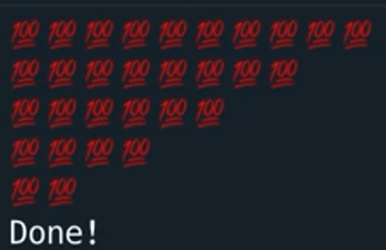

# What Is Recursion?

Before we start, go Google 'recursion'.

Did you get this?


Those cats at Google are *hilarious*, aren't they?

##
👉 Recursion is a type of program where you get a subroutine **to call itself**. It gets kinda hard to explain. I'd very much recommend [this book](https://www.amazon.co.uk/Think-Like-Programmer-Introduction-Creative/dp/1593274246), which does an excellent job of explaining this concept.

Recursion lets us solve problems in a more human way. Some mathematical problems **can just be solved better** using recursion.

For example:

We want to print out a sequence of the same emoji, reducing by 2 emojis per line. (eg print a row of 9, then a row of 7, then 5, etc. until we get none).

We will end up with a reverse pyramid pattern.

We *could* use `range()`, but it's a bit odd with counting backwards. Or a loop, but that would be pretty long.

👉 Here's an example of a recursive solution.

```python
def reverse(value):
  if value <= 0:
    print("Done!")
    return
  # This `if` provides the 'stop' condition for the program. Otherwise it would run forever.

  else: # if we're not at the stop condition.
    for i in range(value):
      print("💯", end="") # Outputs 'value' emojis
    print() # New line
    reverse(value - 2) # takes 2 off the value and calls the subroutine again with this new number. Eg if value was 7 it would call 'reverse(value)' again with value as 5.
reverse(5)
```

Try calling this with 10 as the argument. Did you get this output? 




